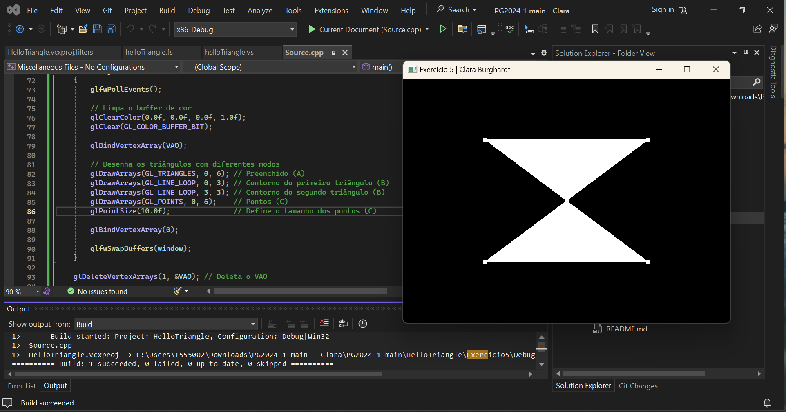
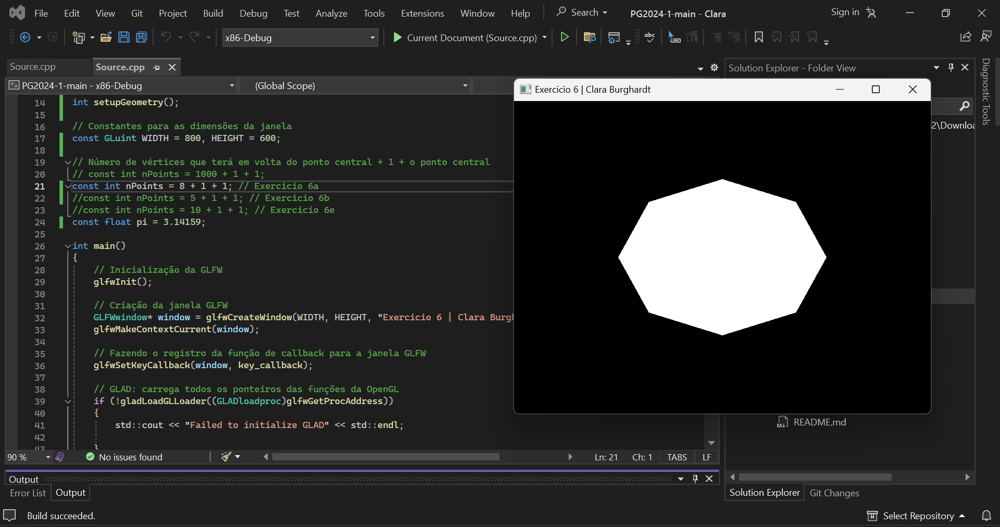

## Introdução à OpenGL Moderna – Shaders & Buffer

<b>1. O que é a GLSL? Quais os dois tipos de shaders são obrigatórios no pipeline programável da versão atual que trabalhamos em aula e o que eles processam?</b>

A GLSL (OpenGL Shading Language) é uma linguagem de programação de alto nível usada para escrever shaders na API OpenGL. Ela permite que os desenvolvedores criem programas que executam operações específicas na GPU para manipular a aparência dos objetos renderizados.
Existem dois tipos de shaders obrigatórios no pipeline programável da versão atual do OpenGL:
- Vertex Shader: processa cada vértice de um objeto e é responsável por transformar as coordenadas dos vértices no espaço do modelo para o espaço de tela. Ele também pode realizar outras operações, como cálculos de iluminação ou deformações do objeto.
- Fragment Shader: processa cada fragmento (ou pixel) gerado pelo rasterizador. Ele é responsável por determinar a cor final de cada fragmento, levando em consideração informações como texturas, iluminação e sombreamento.

<b>2. O que são primitivas gráficas? Como fazemos o armazenamento dos vértices na OpenGL?</b>

Primitivas gráficas são formas geométricas básicas, como pontos, linhas e triângulos, que são usadas para representar objetos na renderização gráfica. Essas primitivas são processadas pelo pipeline gráfico da OpenGL para gerar a imagem final na tela.
Na OpenGL, os vértices de uma primitiva são armazenados em buffers de vértices (vertex buffers). Esses buffers são criados e gerenciados pelo desenvolvedor e podem ser alocados na memória do sistema ou na memória da GPU. Os vértices são definidos como uma sequência de atributos, como posição, cor e coordenadas de textura.

<b>3. Explique o que é VBO, VAO e EBO, e como se relacionam (se achar mais fácil, pode fazer um gráfico representando a relação entre eles).</b>

VBO (Vertex Buffer Object), VAO (Vertex Array Object) e EBO (Element Buffer Object) são objetos usados para armazenar e organizar os dados dos vértices em um programa OpenGL.
- VBO: É um objeto que representa um buffer de vértices. Ele armazena as informações dos vértices, como suas posições, cores e coordenadas de textura. Os VBOs podem ser usados para armazenar dados de vértices em memória de sistema ou memória da GPU.
- VAO: É um objeto que representa um array de vértices. Ele armazena as configurações de atributos dos vértices, como o layout dos dados no V

<b>4. Analise o código fonte do projeto Hello Triangle. Localize e relacione os conceitos de shaders, VBOs e VAO apresentados até então. Não precisa entregar nada neste exercício</b>

1. Shaders:
   A classe "Shader" é utilizada para compilar e vincular os shaders do programa.
   Os shaders são carregados a partir dos arquivos "helloTriangle.vs" e "helloTriangle.fs".
   O shader de vértices é responsável por processar os vértices da geometria e o shader de fragmentos é responsável por processar a cor de cada fragmento (pixel) da geometria.
2. VBOs (Vertex Buffer Objects):
   A função "setupGeometry2" é responsável por criar um VBO e armazenar as coordenadas dos vértices da geometria.
   O VBO é gerado com a função "glGenBuffers" e vinculado como um buffer de array com a função "glBindBuffer".
   Os dados dos vértices são enviados para o VBO com a função "glBufferData".
   O VBO é desvinculado com a função "glBindBuffer" para evitar bugs.
3. VAOs (Vertex Array Objects):
   A função "setupGeometry2" também é responsável por criar um VAO.
   O VAO é gerado com a função "glGenVertexArrays" e vinculado com a função "glBindVertexArray".
  O VAO é configurado com a função "glVertexAttribPointer" para especificar o layout dos atributos dos vértices.
   O VAO é desvinculado com a função "glBindVertexArray" para evitar bugs.

Em resumo, os shaders são responsáveis pelo processamento dos vértices e cores da geometria, os VBOs são utilizados para armazenar os dados dos vértices e os VAOs são utilizados para configurar o layout dos atributos dos vértices.

<b> 5. Faça o desenho de 2 triângulos na tela. Desenhe eles: </b>

a. Apenas com o polígono preenchido

b. Apenas com contorno

c. Apenas como pontos

d. Com as 3 formas de desenho juntas

<b> 6. Faça o desenho de um círculo na tela, utilizando a equação paramétrica do círculo para gerar os vértices. Depois disso: </b>

a) Desenhe um octágono

b) Desenhe um pentágono

c) Desenhe um pac-man!

d) Desenhe uma fatia de pizza

e) DESAFIO: desenhe uma “estrela”

<b>7. Desenhe uma espiral, assim:</b>

<b>8. Considerando o seguinte triângulo abaixo, formado pelos vértices P1, P2 e P3, respectivamente com as cores vermelho, verde e azul.</b>

a. Descreva uma possível configuração dos buffers (VBO, VAO e EBO) para representá-lo.

b. Como estes atributos seriam identificados no vertex shader?

Agora implemente!

<b>9. Faça um desenho em um papel quadriculado (pode ser no computador mesmo) e reproduza-o utilizando primitivas em OpenGL. Neste exercício você poderá criar mais de um VAO e fazer mais de uma chamada de desenho para poder utilizar primitivas diferentes, se necessário.</b>

