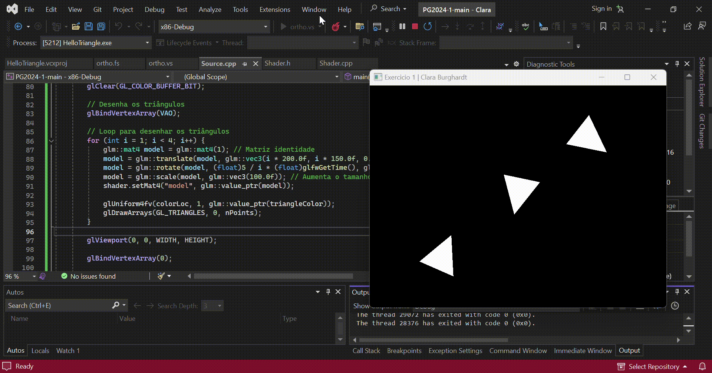
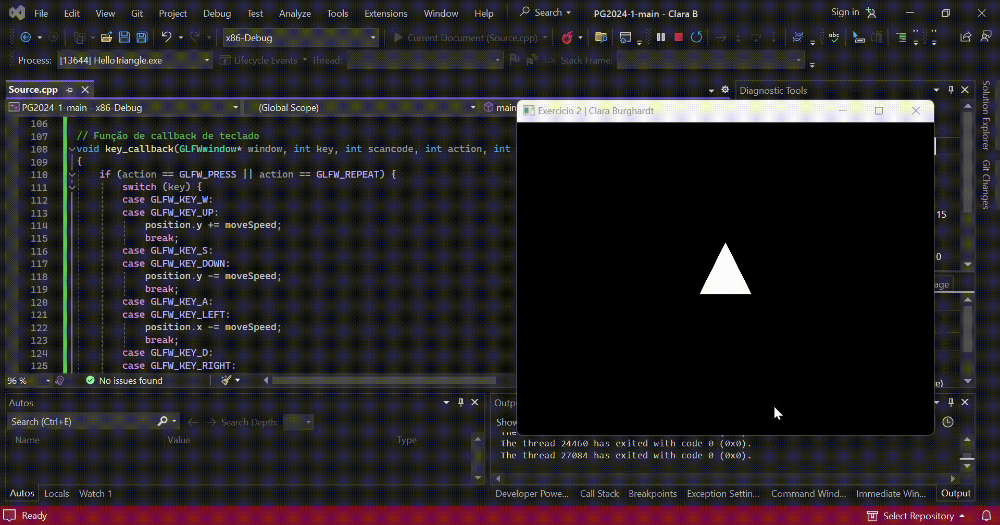
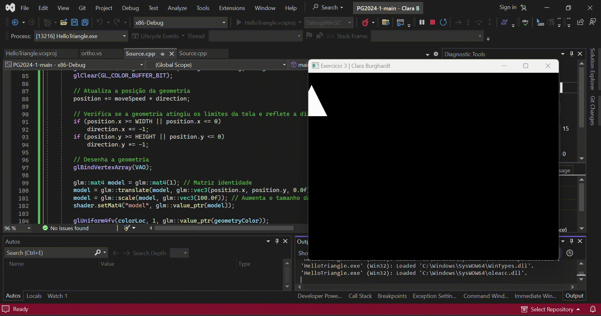

## Introdução à OpenGL Moderna – Transformações em Objetos

<b>1. Desenhe uma mesma geometria 3 vezes na tela, aplicando transformações diferentes (mesmo VAO, matrizes de transformações diferentes, 3 chamadas de desenho).</b>

<b>Altere a posição de uma geometria (triângulo ou retângulo) nas 4 direções (cima, baixo, esquerda e direita) utilizando comandos de teclado para o controle (WASD ou setas).</b>

<b>(Desafio-extra) “Screensaver”: implemente um algoritmo que controle uma geometria (triângulo ou quadrilátero) com comportamento parecido com o do jogo “Pong” (quando atinge os limites da tela, espelha o vetor de direção).</b>

